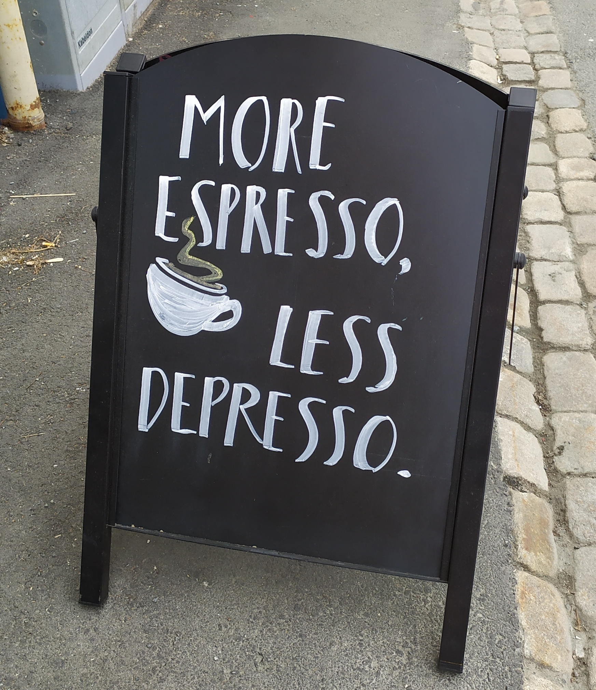

```{=html}
<div id="html-intro" class="section level1 unnumbered">
  <h1 class="hasAnchor">HTML Preface<a href="#html-intro" class="anchor-section"></a></h1>
  <p> 
    Welcome to my e-thesis! Here's is a reward for you that chose this format to read my thesis: 
  </p>

  </img>

  <p>
    You may see some more of these around the HTML text to make your reading experience more enjoyable! You can download from the <strong>top toolbar</strong> the more serious PDF that also includes the papers if you'd like. <br><br> Btw, feel free to use the code the made this GitBook if you want! Enjoy (^-^)
  </p>
</div>
```

# Acknowledgements {-}

I first acknowledge funding from the **ERACoSysMed project COLOSYS**. Now to people, the most important part: **I would like to thank everyone** that interacted with me during the years I conducted my PhD research (2017-2021), even for a tiny bit. A person is only a small node in a complex network of interactions, which only when considered together, make up the person. In other words, you are not just you! So, you were **all important** for me (and for others I am sure)! Importance though is measured in varying degrees. Therefore now, I will proceed to give some personal credits (the part that most of you came here to read :)

A big **THANK YOU** to my supervisor, Prof. Martin Kuiper. He gave me the opportunity to come to Norway, which opened a world of possibilities. The dream supervisor everyone should have and a caring human being above all. A true gentleman and an unsurpassed cook as well!

To Dr. Åsmund Flobak for excellent co-supervision, the nice scientific discussions we had and for introducing me into `R`, which largely influenced the way I do science. Spending time with his lively family was always a nice change of pace. That day we were all together at Amsterdam's zoo and I saw my first penguins, will remain unforgettable!

```{=html}
</img>
```

To Dr. Steven Vercruysse for our scientific discussions and for teaching me and ins and outs of web software development. I will never forget the ELIXIR Biohackathon 2020, great laughs and great work, all in one. And of course, I will never forget the "tour" . Thanks Steven!

To Prof. Astrid Laegreid, for suggesting to me to participate in the Responsible Research and Innovation (RRI) course, which inspired me to think more broadly about my research and the world we live in, and of course meet several wonderful people! That's also how I became acquainted with Digital Life Norway (DLN). Liv Eggset Falkenberg did an excellent job at coordinating the DLN Research School and she was co-organizer of the Walkshop in Jotunheimen (September 2019), which was a truly wonderful experience. With DLN, I had the benefit of participating in various conferences across Norway and the opportunity to do an industry internship in Sweden during the cold winter of 2021, so thanks DLN and Liv!

To Noemi Del Toro Ayllon, for introducing me to the professional world of software development and project management with Java. Visiting the IntAct team at EBI during the summer of 2018 was a memorable experience and when she came to Trondheim later in 2019, we had such a great time, so thank you Noe!

To Henning Hermjacob, for not just being the scientific host for my visits to EBI in England, but also for hosting me in his lovely Airbnb house each time! Spending a few months in Cambridge during my PhD was a truly marvelous experience, so thanks Henning!

To Prof. Denis Thieffry, for the nice scientific discussions and for distilling some of his passion for logical modeling into me, resulting in one of the papers in this thesis.

And of course, **to my colleagues from the DrugLogics group**, for the good times we spent inside and outside of work! I am especially grateful to Barbara Niederdorfer and Evelina Folkesson for our music collaborations. Eirini Tsirvouli has been a very positive, dynamic presence. Rafel Riudavets Puig has been a really close friend - I hope that in the future we get to continue our random walks that somehow always end up in McDonalds! Marcio Luis Acencio has been a good friend as well, with a wonderful family that gained two new members I got to meet before he left our group! Vasundra Touré has been a wonderful colleague, a true source of light for the time we spend at our office in Gloshaugen. Wine, cheese, standards and good memories! Also, favorite cafe buddies with Anamika Chatterjee - we certainly made Espresso House richer!

Last but not least, a big **THANKS** to the beautiful city of Trondheim! I've had some really inspirational walks in these historic roads. And to its nice coffee shops I've been working throughout my PhD! Diverse working environment is extremely important and as it was perfectly stated:

```{r depresso-img, fig.align='center', echo=FALSE, out.width="40%"}

```

:::{.right-align data-latex=""}
John Zobolas,
May 2021
:::
